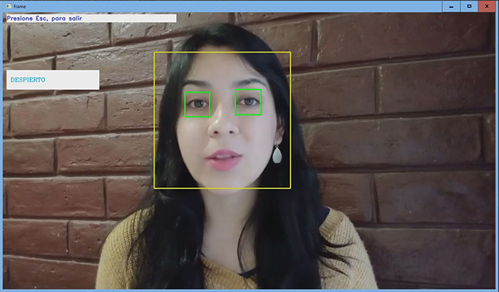
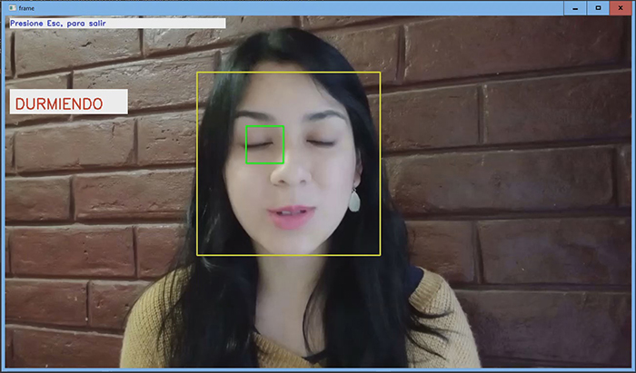
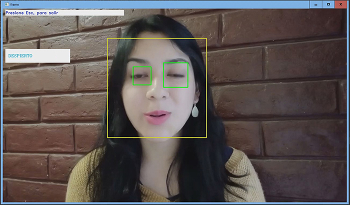

## Proyecto TP6 / CEIA - UBA

Autor:
* Iván Cruz Flores


## Enunciado:
Una empresa de transporte quiere monitorear la actividad de sus conductores durante el manejo Para ello se propone implementar un detector de somnolencia en tiempo real tomando como datos de entrada frames provenientes de una cámara que apunta al rosto
del conductor.

## Recursos:
Se usó un video en calidad HD 720P.
```
video_demo_720p.mp4

```

## Resultados:
Estado del detector: DESPIERTO.



Estado del detector: DURMIENDO.



Estado del detector: PARPADEO.



## Demostración de Funcionamiento:
* Funcionamiento.

 https://youtu.be/dnoLI4zeOXg


## Licence:

This project is published under GPLV3+ licence.


